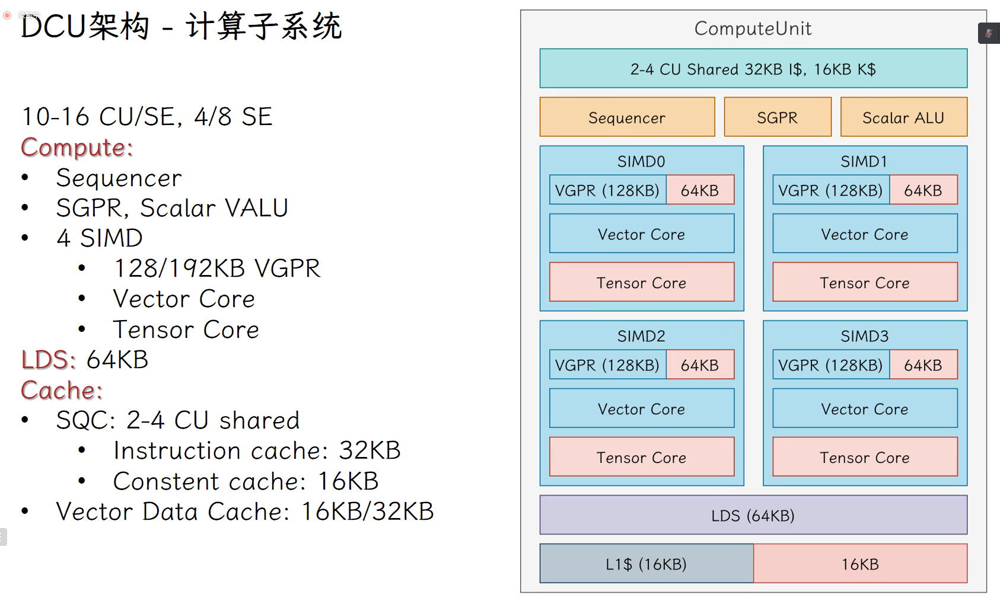
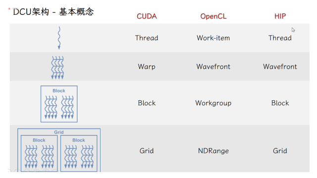
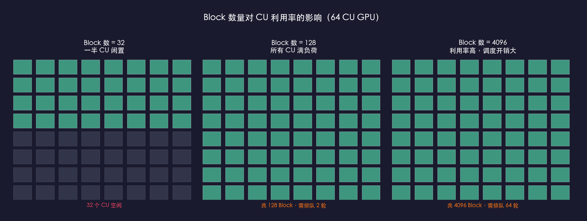
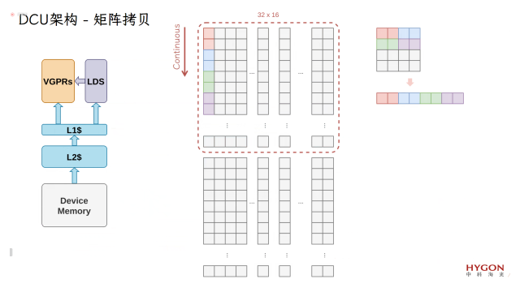
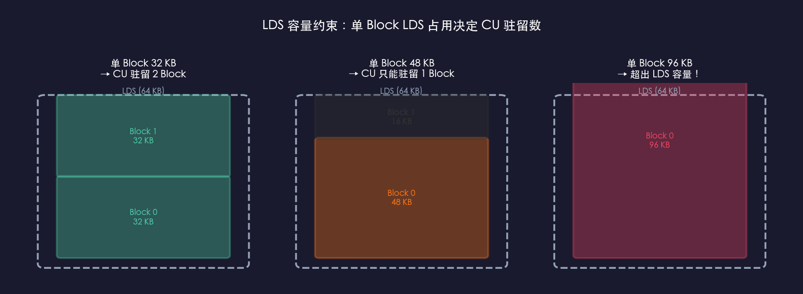
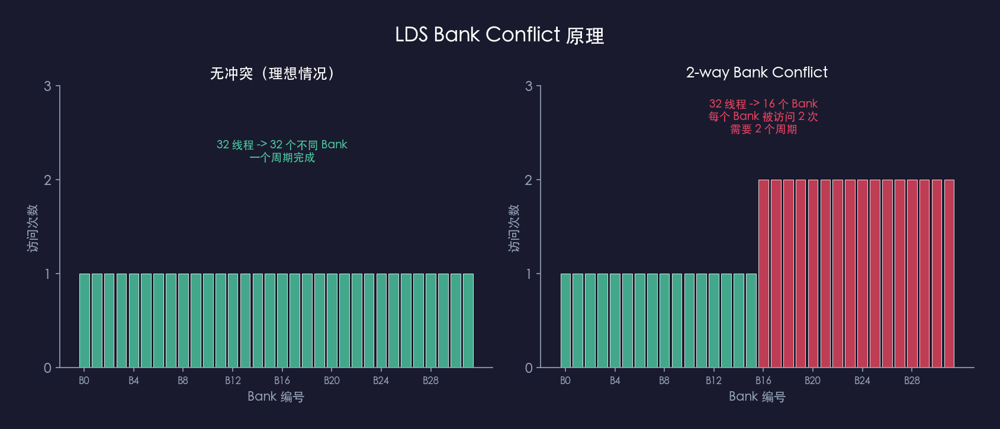
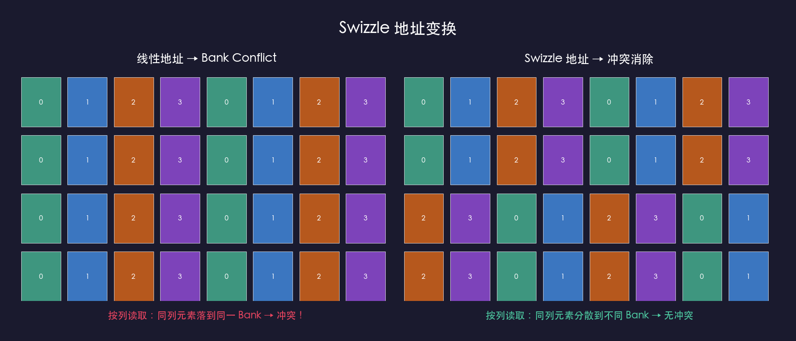
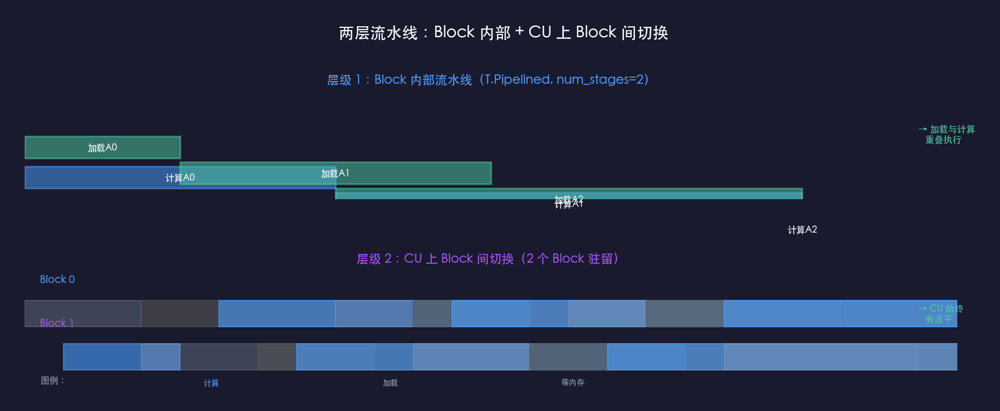
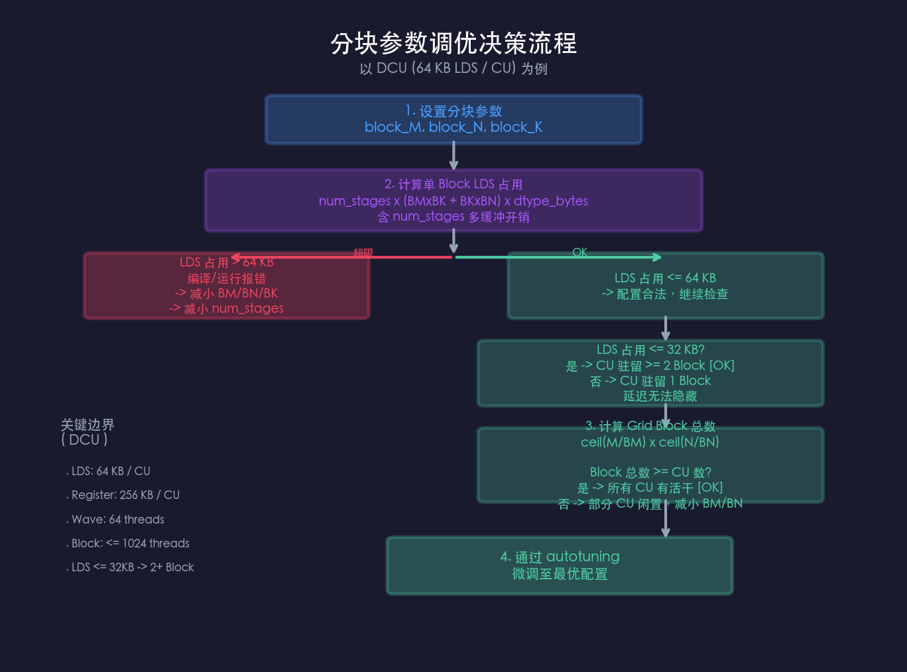

# GPU 硬件与编程模型基础

> 本文档以海光 DCU 为主要参考硬件，讲解 GPU 硬件架构、调度模型和内存层次，是 TileLang 算子开发的前置学习文档。DCU 编程模型与 NVIDIA GPU 高度相似（均采用 SIMT 架构），主要差异：DCU Wave = 64 线程（NVIDIA Warp = 32 线程），LDS = 64 KB/CU。

## 一、硬件约束速查

| 参数 | DCU | NVIDIA | 对 TileLang 的意义 |
|------|-----|--------|-------------------|
| 计算单元 | CU | SM | 硬件实体，执行 Block |
| 调度粒度 | Wave = **64 线程** | Warp = 32 线程 | `thread_num` 必须整除 64 |
| Block 最大线程数 | **1024** | 1024 | 单 Block 硬限制 |
| 共享内存 | LDS = **64 KB / CU** | 48-164 KB / SM | 分块参数第一硬约束，超出编译报错 |
| LDS Bank 数量 | 32 | 32 | Bank Conflict 相关（见第三章） |



> CU 内部结构很复杂，但写 TileLang 时只需要盯三个数字：**LDS 64KB**（分块上限）、**Wave 64 线程**（线程数约束）、**Block 上限 1024 线程**。SIMD 调度、VGPR 分配均由编译器自动处理，不需要手动干预。

---

## 二、CU、Block、Wave、线程的关系



### 2.1 四层关系

从细到粗：

```
Thread（线程）→ Wave（64线程束）→ Block（线程块）→ Grid（计算网格）
  ↑                    ↑                  ↑                ↑
 私有寄存器          SIMT指令发射      独占CU的LDS       Block队列分配给CU
```

**各层定义**：

- **Thread**：执行指令的最小单元，拥有私有寄存器
- **Wave**：CU 内部以 64 线程为单位发射指令，同 Wave 内线程同时执行同一条指令（SIMT）
- **Thread Block**：调度最小不可分单元，绑定一个 CU，独占该 CU 的 LDS；负责输出 C 的一块 tile：`C[by×block_M : (by+1)×block_M, bx×block_N : (bx+1)×block_N]`；Block 内线程通过 LDS 和 Barrier 同步，不同 Block 无法通信
- **Grid**：逻辑坐标系，给每个 Block 分配坐标 `(bx, by)`，硬件调度器将 Block 逐个分配给 CU

### 2.2 CU 驻留 Block 数

一个 CU 能驻留几个 Block，取决于 LDS 能放下几份 tile：

```
CU驻留Block数 = floor(64KB / 单Block LDS占用)
             = floor(64KB / (num_stages × (block_M × block_K + block_K × block_N) × dtype_bytes))
```

以 `block_M=128, block_N=128, block_K=32, fp16, num_stages=2` 为例：

```
单Block LDS = 2 × (128×32 + 32×128) × 2 bytes = 32KB
CU驻留Block数 = floor(64KB / 32KB) = 2
```

CU 驻留 ≥ 2 个 Block 才能隐藏访存延迟——Block 0 等 HBM 数据时切到 Block 1。`block_M/block_N` 越大 → 单 Block 吃越多 LDS → CU 驻留数越少。

### 2.3 线程数怎么设置

`thread_num` 是 autotuning 参数，不等于 `block_M × block_N`（那是输出 tile 的元素数）。每个线程处理多个输出元素：

```
每线程处理元素数 = block_M × block_N / thread_num
```

| block_M×block_N | thread_num | 每线程处理 | Wave 数 |
|-----------------|------------|-----------|---------|
| 128×128 = 16384 | 128 | 128 个元素 | 2 |
| 128×128 = 16384 | 256 | 64 个元素 | 4 |
| 256×64 = 16384 | 256 | 64 个元素 | 4 |

`thread_num` 太小 → 每线程负担重；太大 → Wave 多，LDS 和寄存器压力增大。一般取 128 或 256，每线程处理 64~128 个元素，具体靠 autotuning。

### 2.4 Grid Block 总数约束

CU 驻留数算好后，还要确保 Grid 有足够 Block 分给所有 CU：



- Grid Block 总数 **最少** ≥ CU 总数，否则部分 CU 闲置
- Grid Block 总数 **最好** ≥ CU 总数 × 2，每个 CU 至少 2 个 Block 做切换
- Grid Block 总数 **不能** 太多（通常 < CU 总数 × 100），调度开销吃掉计算时间

**实例**：M=N=4096, block_M=128, block_N=128：

```
m_blocks = 4096 / 128 = 32, n_blocks = 4096 / 128 = 32
Grid Block 总数 = 32 × 32 = 1024 → 80 个 CU 各分 12 个，充足
```

矩阵太小时会出问题：M=N=256, block_M=128, block_N=128：

```
m_blocks = 2, n_blocks = 2
Grid Block 总数 = 4 → 80 个 CU，76 个闲置
```

persistent GEMM 用 `grid_size = min(m_blocks × n_blocks, wgs_per_cu × cu_num)` 应对小矩阵，`wgs_per_cu=2` 确保每个 CU 至少分到 2 个 Block。

`block_M/block_N` 越大 → m_blocks × n_blocks 越少 → Grid Block 总数越少。既要 CU 能驻留 ≥ 2 个（LDS 约束），又要 Grid 喂饱所有 CU，两者需要平衡。

---

## 三、内存层次

### 3.1 四级存储

| 内存 | 硬件 | 典型容量 | 延迟 | 可见范围 |
|------|------|---------|------|---------|
| 全局内存 | HBM | ~数十 GB | ~数百 cycles | 所有 Block |
| L2 Cache | L2 | ~数 MB | ~百 cycles | 所有 CU（硬件自动） |
| 共享内存 | LDS | **64 KB / CU** | ~数十 cycles | Block 内所有线程 |
| 寄存器 | VGPR | ~256 KB / CU | ~1 cycle | 线程私有 |

核心优化思路：**把数据从慢的 HBM 搬到快的 LDS 和寄存器里反复用，减少对 HBM 的访问次数。** LDS 超限编译报错，寄存器超限发生 spilling。

### 3.2 Tiling 分块与数据加载路径



矩阵乘法 $C_{M×N} = A_{M×K} × B_{K×N}$，不分块时每个元素直接从 HBM 读取，复用率为零。分块策略：把 A、B 切成 Tiles，每次将一对小块从 HBM 搬到 LDS，Block 内线程从 LDS 高速读取计算，沿 K 维度滑动累加。



单 Block LDS 占用和 CU 驻留数见 2.2 节。

**数据加载的两种路径**（以 persistent GEMM 为例）：

**路径一：HBM → LDS → Tensor Core**（基础版）

```
T.copy(A[HBM], A_shared[LDS])              # 直接写入 LDS
T.gemm(A_shared[LDS], B_shared, C_local)   # Tensor Core 从 LDS 读取
```

最简洁。A/B tile 进入 LDS 后被 Block 内线程共享复用。代价是 LDS 读取时可能发生 Bank Conflict（见 3.3 节）。

**路径二：HBM → VGPR → LDS(swizzle) → VGPR → Tensor Core**（带 swizzle）

```
T.copy(A[HBM], A_local_0[VGPR])            # 先读到寄存器
T.copy(A_local_0[VGPR], A_shared[LDS])     # 写入 LDS
T.copy(A_shared[LDS], A_local_0_[VGPR])    # 按 swizzle 变换后读回
T.gemm(A_local_0_[VGPR], B_local_0_, C_local)
```

绕路是为了在 LDS 中做 swizzle 消除 Bank Conflict，LDS 带宽跑满。代价是 VGPR 中转多，寄存器压力大。

**选择**：LDS 带宽瓶颈 → 路径二；寄存器紧张 → 路径一。靠 autotuning 决定。

> **TileLang 实战**：block_K 太小（16）→ 加载量不足以摊平延迟；太大（128）→ 加载过久不利于 overlap。DCU 上 block_K=32 或 64 是常见平衡点。数据行优先连续时编译器自动合并 HBM 请求；`coalesced_width=8` 控制 128-bit 访存粒度。

### 3.3 Bank 与 Bank Conflict

LDS 内部被组织成 32 个 Bank，每个 Bank 是独立的读写通道。

> **同一 Bank 同一时刻只能服务一个请求。多个线程同时访问同一 Bank 的不同地址时，访问串行化。**

地址映射：`Bank = (字节地址 / 4) % 32`。

**Bank Conflict** 发生在同一 Wave 内多个线程同时访问同一 Bank 的不同地址：



N-way conflict 需要 N 个周期，最坏 64 线程全冲突，吞吐量降至 1/64。

典型场景：64 个线程按列从 LDS 读取 `block_M × block_K` 的 `A_shared`（fp16），`block_K=32` 时行间地址差 64 bytes，每 2 行在 Bank 映射上差 16 个 Bank，导致 2-way conflict，LDS 带宽减半。

### 3.4 Swizzle：消除 Bank Conflict



Swizzle 对地址做 XOR 变换，打乱 Bank 映射。TileLang 中使用 `T.annotate_layout` 声明，`major_pack=N` 控制向量化宽度。

**何时需要关心**：手动 Fragment ↔ Shared 流转时，或 Profiling 发现 LDS 带宽利用率远低于理论值（~50-60% 而非 ~90%）。`T.gemm` 输入是 Shared Memory 时编译器通常自动处理。

---

## 四、Tiling 调优

### 4.1 两层流水线



| | Block 内部流水线 | Block 间切换 |
|---|---|---|
| 作用范围 | 一个 Block 内部 | 一个 CU 内部多个 Block |
| 机制 | `num_stages` 阶段交替（加载/计算重叠） | 硬件调度：Block 0 等 HBM 时切到 Block 1 |
| 控制参数 | `num_stages`（T.Pipelined） | 单 Block LDS 占用（间接决定 CU 驻留数） |
| 代价 | LDS × num_stages | 无额外代价 |

两层互补：Block 内部流水线隐藏单次加载延迟，Block 间切换隐藏极端等待。

### 4.2 调优决策流程



---

## 五、DCU 配置速查

以 block_K=32, fp16, num_stages=2 为例，LDS 公式：`2 × (block_M × 32 + 32 × block_N) × 2 bytes`

| block_M×block_N | 单Block LDS | CU驻留Block数 | Grid Block总数（M=N=4096） | 评价 |
|-----------------|------------|--------------|--------------------------|------|
| 64×64 | 16 KB | 4 | 4096 | Block 太多，调度开销高 |
| 128×64 | 24 KB | 2 | 2048 | Block 偏多 |
| **128×128** | **32 KB** | **2** | **1024** | 推荐起点：LDS 50%，驻留 2 Block |
| 256×128 | 48 KB | 1 | 512 | 危险：无法隐藏访存延迟 |
| 256×256 | 96 KB | 0 | 256 | 编译报错：LDS 超限 |

`128×128` 是 DCU 上合理的起点，具体最优值通过 autotuning 确定。
