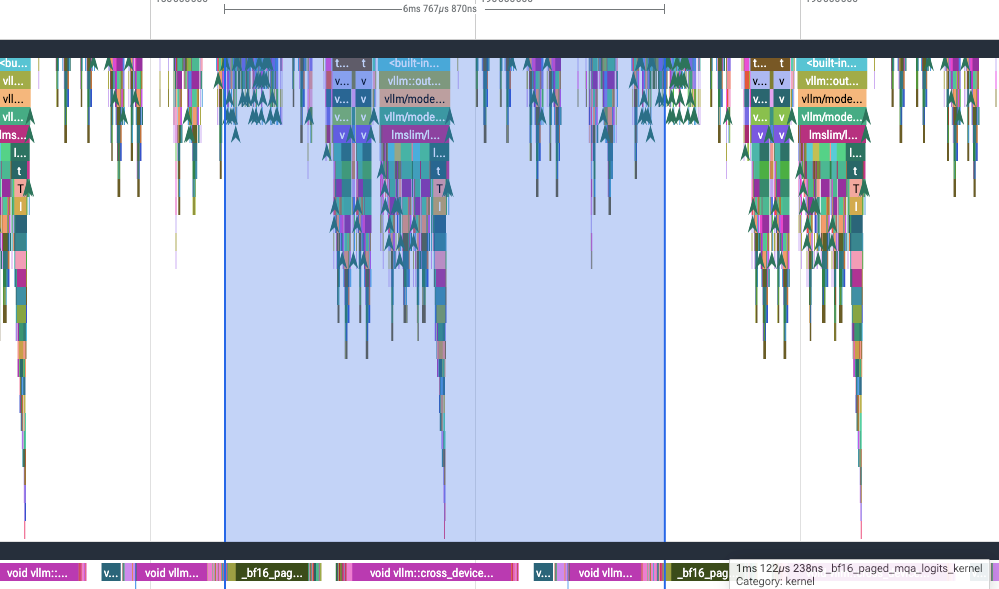
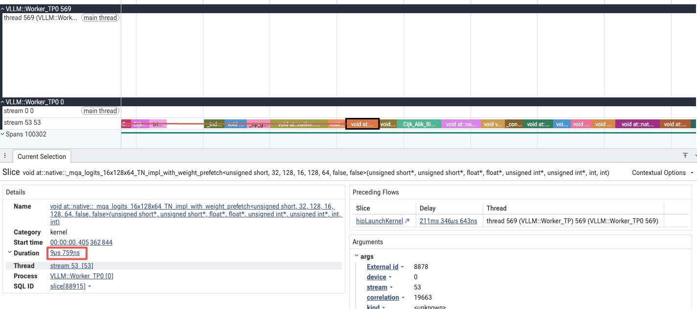

# Paged MQA Logits 算子技术分享

## 一、背景与公式

### 1.1 算子定义

**输入**（每个 batch）：

$$
\begin{aligned}
Q &\in \mathbb{R}^{H \times D} \quad &\text{(query, } H \text{ 头，每头 } D \text{ 维)} \\
K &\in \mathbb{R}^{L \times D} \quad &\text{(历史 keys, } L \text{ 为 context 长度，MQA 下单头)} \\
w &\in \mathbb{R}^{H} \quad &\text{(门控权重，每头一个标量)}
\end{aligned}
$$

**输出**：

$$
\text{logits} \in \mathbb{R}^{L}
$$

**核心公式**：

$$
\text{logits}[k] = \sum_{h=0}^{H-1} \mathrm{relu}\big(Q[h] \cdot K[k]\big) \times w[h], \quad k = 0, \dots, L-1
$$

**矩阵形式**（$K \in \mathbb{R}^{L \times D}$, $Q \in \mathbb{R}^{H \times D}$, $w \in \mathbb{R}^{H}$）：

$$
\mathrm{logits} = \sum_{h=0}^{H-1} \mathrm{relu}(K Q^{\top}) \odot w
$$

即先做 $K Q^{\top}$ 得到 $[L, H]$ 的分数矩阵，逐元素 $\mathrm{relu}$ 后乘以门控权重 $w$（广播），最后沿 heads 维度求和得到 $[L]$ 的 logits 向量。

> **与标准 attention 的区别**：标准 attention 做 $\mathrm{softmax}(QK^{\top}/\sqrt{d})V$，这里**不做 softmax、不乘 V**，而是用 relu + 门控权重 + 多头求和替代。输出 logits 供下游路由/打分模块使用（如 DeepSeek-V2 MLA 架构）。

### 1.2 公式深度解读

> 本节紧接公式，逐层拆解"这个公式在算什么、为什么这么算"。如果你对公式中的 $\sum_{h}$、$\mathrm{relu}$、$w[h]$ 等符号的含义已经清晰，可跳过本节直接阅读 1.3。

#### ① 微观视角：单个 token 的四步流水线

固定看第 $k$ 个历史 token（即 $K[k]$），它的计算流程是四步：

| 步骤 | 数学操作 | 作用 |
|------|---------|------|
| **1. 点积** | $Q[h] \cdot K[k]$ | 计算"第 $h$ 个查询头"与"第 $k$ 个历史 Key"的相似度 |
| **2. ReLU** | $\max(0, \text{score})$ | 负分归零，只保留"正向激活" |
| **3. 门控加权** | $\times w[h]$ | 用可学习权重控制每个头的贡献度 |
| **4. 求和归约** | $\sum_{h}$ | 把所有头的意见压成**一个标量** |

**最终输出**：$\text{logits}[k]$ = 所有 Query Head 对第 $k$ 个历史 token 的**正相关响应的加权总和**。

#### ② 宏观视角：张量形状如何变化？

$$\underbrace{K}_{[L, D]} \times \underbrace{Q^{\top}}_{[D, H]} \xrightarrow{\text{GEMM}} \underbrace{\text{Scores}}_{[L, H]} \xrightarrow{\text{ReLU}} \underbrace{[L, H]}_{\text{不变}} \xrightarrow{\times w \text{ + sum}} \underbrace{\text{logits}}_{[L]}$$

- $[L, H]$ 分数矩阵：第 $k$ 行代表第 $k$ 个 token 与所有 $H$ 个 Query 头的点积。
- 消去 Heads 维度后，从 $[L, H]$ 坍缩为 $[L]$。

#### ③ 设计哲学：为什么长这样？

| 对比维度 | 标准 Attention (Softmax) | 本算子 (ReLU + Gate) |
|---------|-------------------------|---------------------|
| **归一化** | 全局归一化（所有 token 分数和为 1） | **无归一化**（绝对值评分，互不干扰） |
| **输出含义** | 概率分布（相对权重） | **未归一化的绝对分数**（排序依据） |
| **多头处理** | 多头各自计算，最后 Concat | **强制归约为一个标量** |
| **Value (V)** | 必须乘 V | **完全不乘 V**（不要特征，只要分数） |

**设计目标**：输出一个**绝对激活强度**，用于对海量历史 Token 做**重要性排序**，而非生成用于融合特征的相对概率。

#### ④ 数值示例：用具体数字走一遍

假设 $H=2$（2 个 Query 头），$D=4$，$L=3$（3 个历史 token）：

**输入数据**：

- $Q$：Head0 = `[1, 0, 1, 0]`，Head1 = `[0, 1, 0, 1]`
- $K$：Token0 = `[1, 1, 0, 0]`，Token1 = `[0, 0, 1, 1]`，Token2 = `[-1, 0, -1, 0]`
- $w$：`[0.8, 0.5]`

**计算过程**：

| Token | Head0 点积 | Head1 点积 | ReLU 后 | 加权求和 | 最终 logits |
|-------|-----------|-----------|---------|---------|-------------|
| Token0 | 1.0 | 1.0 | [1.0, 1.0] | 1.0×0.8 + 1.0×0.5 | **1.3** |
| Token1 | 1.0 | 1.0 | [1.0, 1.0] | 1.0×0.8 + 1.0×0.5 | **1.3** |
| Token2 | -2.0 | 0.0 | [0.0, 0.0] | 0.0×0.8 + 0.0×0.5 | **0.0** |

**输出**：$\text{logits} = [1.3, 1.3, 0.0]$

Token2 因所有点积为负，被 ReLU 彻底抹杀，得分为 0，在后续排序中自然垫底。

### 1.3 分块计算

K 按固定大小 $B = 64$ 行切分为逻辑块。对第 $t$ 个逻辑块（$K_t \in \mathbb{R}^{B \times D}$）：

$$
\mathrm{logits}_t = \sum_{h=0}^{H-1} \mathrm{relu}(K_t Q^{\top}) \odot w \quad \in \mathbb{R}^{B}
$$

每个 CTA 处理一个逻辑块，通过 `block_table` 查表找到 $K_t$ 所在的物理地址。

### 1.4 为什么是 "Paged"

KV cache 不是连续存储的，而是按固定大小 block（$B = 64$ 行/block）分页存储。每个 batch 的 `block_table` 记录逻辑位置到物理 block 的映射，和操作系统的虚拟内存分页类似：

- 消除显存碎片（所有 block 尺寸统一）
- 支持变长序列，无需预分配最大长度
- 支持 prefix caching（多个请求共享同一物理 block）

计算时先查表：`phys_block = block_table[b][logical_block]`，再从 `KV[phys_block]` 读取。

### 1.5 与标准 GEMM 的区别

| | 标准 GEMM | Paged MQA Logits |
|---|---|---|
| 输出 | `[M, N]` 矩阵 | `[batch, max_context_len]`（heads 被归约掉） |
| K 维度遍历 | 连续 K 维度切 tile | 按 **logical block** 切 tile，查表映射物理 block |
| 后处理 | 无 | relu + 门控加权 + reduce_sum |
| Grid 组织 | `(M, N)` 每 tile 一个 Block | `(max_block_len, batch)` 每个 logical KV block 一个 Block |

---

## 二、性能数据

### 2.1 DCU 实测 vs 手写 HIP 汇编

以 lightop 手写 HIP 汇编为 baseline：

```
Case                             B    H    D  avg_ctx  tilelang(ms)   lightop(ms)   speedup
------------------------------------------------------------------------------------------------
bs1_H32_D128_4k                  1   32  128     4096         0.132         0.075     1.76x
bs64_H32_D128_4k                64   32  128     4096         0.187         0.192     0.97x
bs128_H32_D128_4k              128   32  128     4096         0.268         0.286     0.94x
bs1_H64_D128_4k                  1   64  128     4096         0.122         0.074     1.66x
bs64_H64_D128_4k                64   64  128     4096         0.301         0.224     1.34x
bs1_H32_D128_72k                 1   32  128    72000         0.121         0.076     1.60x
bs1_H64_D128_72k                 1   64  128    72000         0.120         0.084     1.42x
```

- **大 batch（≥64）**：与手写汇编基本持平（0.94x ~ 1.34x）
- **小 batch（=1）**：慢 1.4x ~ 1.8x，Grid block 数太少，多数 CU 闲置

### 2.2 vLLM Profiler：GLM-5.1 优化前后

GLM-5.1 共 **78 层**，优化前为 vLLM 默认 CUDA kernel，优化后替换为本 TileLang 算子。

| 指标 | 优化前 | 优化后 | 提升 |
|------|--------|--------|------|
| **算子延迟** | ~1 ms | ~10 μs | **~100×** |
| **单层 Layer 延迟** | ~4 ms | ~3 ms | **-1 ms（-25%）** |
| **78 层总延迟** | ~312 ms | ~234 ms | **-78 ms（-25%）** |

> 算子从毫秒级降至微秒级（~100×），单层节省 ~1ms，78 层累积节省 ~78ms/step。



> 优化前：算子耗时 ~1ms，是单层 Layer 的性能瓶颈。



> 优化后：算子耗时 ~10μs，瓶颈消除，单层从 4ms → 3ms。

---

## 三、数据布局

```
Q:            [batch_size, heads, D]           bfloat16   （view from [B, next_n, H, D]，next_n=1）
KV cache:     [num_blocks, BLOCK_KV=64, 1, D]  bfloat16   （K 无 heads 维度，block 内 64 行连续）
Weights:      [batch_size, heads]              float32    （与 gemm accum_dtype 对齐）
Block table:  [batch_size, max_block_len]      int32      （逻辑 block → 物理 block 映射）
Logits:       [batch_size, max_context_len]    float32    （直接供下游 softmax 使用）
Context lens: [batch_size]                     int32
```

几个设计决策：

- **KV 存为 `[N, D]` 而非 `[K, N]`**：每个物理 block 内 64 行连续存储，读取时一行一次加载。`T.gemm(k_smem, q_smem, s, transpose_B=True)` 告诉编译器 Q 被隐式转置为 `[D, heads]`，实现 `K × Q^T`。
- **Weights 和 Logits 都是 float32**：后处理 `relu × weight` 与 gemm 累加器同精度，避免多次类型转换的精度损失。

---

## 四、完整代码

以下是从 `examples/paged_mqa_logits.py` 提取的核心 kernel（去掉了 benchmark 和接口包装层）：

```python
@tilelang.jit(pass_configs={tilelang.PassConfigKey.TL_ENABLE_FAST_MATH: True})
def paged_mqa_logits_kernel(
    heads: int,
    head_dim: int,
    tile_k_token: int = 64,
    num_stages: int = 1,
    threads: int = 256,
    policy: str = "square",
):
    """
    TileLang BF16 paged MQA logits kernel.

    MQA (Multi-Query Attention):
      All heads share a single K, but each head has its own Q and gate weight.
      Example: hidden_dim=4096, head_dim=128 → heads=32.

      Q:       [heads=32, dim=128]     ← 32 heads, each 128-dim query
      K:       [L, dim=128]            ← single key, no heads dimension
      weights: [heads=32]              ← one scalar gate per head
      logits[k] = sum_h(relu(Q[h] · K[k]) × w[h])
    """
    dim = head_dim
    dtype = T.bfloat16
    accum_dtype = T.float32
    index_dtype = T.int32
    K_PACK = 1
    gemm_policy = T.GemmWarpPolicy.FullRow if policy == "full_row" else T.GemmWarpPolicy.Square

    batch_size = T.dynamic("batch_size")
    num_blocks = T.dynamic("num_blocks")
    max_num_blocks = T.dynamic("max_num_blocks")
    max_context_len = T.dynamic("max_context_len")

    @T.prim_func
    def kernel(
        q: T.Tensor([batch_size, heads, dim], dtype),
        kv_cache: T.Tensor([num_blocks, BLOCK_KV, 1, dim], dtype),
        logits: T.Tensor([batch_size, max_context_len], accum_dtype),
        weights: T.Tensor([batch_size, heads], accum_dtype),
        block_table: T.Tensor([batch_size, max_num_blocks], index_dtype),
    ):
        with T.Kernel(max_num_blocks, batch_size, threads=threads) as (kv_logical_page_idx, batch_idx):
            phys_kv_page_id = block_table[batch_idx, kv_logical_page_idx]
            global_offset = kv_logical_page_idx * BLOCK_KV

            q_smem = T.alloc_shared([heads, dim], dtype)
            k_smem = T.alloc_shared([tile_k_token, dim], dtype)
            s = T.alloc_fragment([tile_k_token, heads], accum_dtype)
            logits_tile = T.alloc_fragment([tile_k_token], accum_dtype)
            w_frag = T.alloc_fragment([heads], accum_dtype)

            T.copy(q[batch_idx, 0:heads, 0:dim], q_smem)
            T.copy(weights[batch_idx, 0:heads], w_frag)

            num_tiles = T.ceildiv(BLOCK_KV, tile_k_token)
            for tile_idx in T.Pipelined(num_tiles, num_stages=num_stages):
                kv_row_start = tile_idx * tile_k_token
                T.copy(
                    kv_cache[phys_kv_page_id, kv_row_start:kv_row_start + tile_k_token, 0, 0:dim],
                    k_smem
                )

                T.clear(s)
                T.gemm(
                    k_smem, q_smem, s,
                    k_pack=K_PACK,
                    transpose_B=True,
                    policy=gemm_policy,
                )

                for row_in_tile, head_idx in T.Parallel(tile_k_token, heads):
                    s[row_in_tile, head_idx] = (
                        T.max(s[row_in_tile, head_idx], T.cast(0, accum_dtype))
                        * w_frag[head_idx]
                    )

                T.reduce_sum(s, logits_tile, dim=1, clear=True)

                for row_in_tile in T.Parallel(tile_k_token):
                    global_pos = global_offset + kv_row_start + row_in_tile
                    if global_pos < max_context_len:
                        logits[batch_idx, global_pos] = logits_tile[row_in_tile]

    return kernel
```

---

## 五、图形化解读

本节不逐行罗列，而是按照**数据从输入到输出的流转过程**，分三个逻辑层次讲解。

以下以典型配置为例：**hidden_dim=4096, head_dim=128, heads=32, BLOCK_KV=64, tile_k_token=32, num_stages=1**。

---

### 5.0 总览：一张图看懂整个算子

```
                          ┌─────────────────────────────────────────────────────┐
                          │                   Paged MQA Logits                   │
                          │          logits[k] = Σ_h relu(Q[h]·K[k]) × w[h]     │
                          └─────────────────────────────────────────────────────┘

  ┌─────────────────┐     ┌──────────────────┐     ┌──────────────────────────────┐
  │  ① Grid 调度     │     │  ② 页表映射 (每CTA) │     │  ③ 单页内 Tile 流水线         │
  ├─────────────────┤     ├──────────────────┤     ├──────────────────────────────┤
  │                 │     │                  │     │                              │
  │  batch_size     │     │  block_table     │     │  KV Page (64 token, 物理页)   │
  │  ┌──┬──┬──┬──┐  │     │  ┌──┬──┬──┬──┐  │     │  ┌────────────────────────┐  │
  │  │0 │1 │2 │..│  │     │  │7 │12│-1│..│  │     │  │ K[ 0:32]  [32,128]      │──┤  │
  │  └──┴──┴──┴──┘  │     │  └──┴──┴──┴──┘  │     │  │    ↓ T.copy → k_smem     │  │  │
  │       ×         │     │  逻辑页→物理页     │     │  │    ↓ T.gemm (× Q^T)     │  │  │
  │  max_num_blocks │     │                  │     │  │    ↓ ReLU × w_frag      │  │  │
  │  ┌──┬──┬──┬──┐  │     │  global_offset   │     │  │    ↓ reduce_sum(dim=1)  │  │  │
  │  │0 │1 │2 │..│  │     │  = page_idx × 64 │     │  │    ↓ T.copy → logits    │  │  │
  │  └──┴──┴──┴──┘  │     │  (写回位置)       │     │  ├────────────────────────┤  │
  │                 │     │                  │     │  │ K[32:64]  [32,128]      │──┤  │
  │  Grid = 64 × bs │     │  phys_kv_page_id │     │  │    (Pipelined 后台加载,  │  │  │
  │  每个 CTA 处理   │     │  = block_table   │     │  │     与上一tile GEMM重叠) │  │  │
  │  1 页 × 1 batch │     │    [b][page_idx] │     │  │    ↓ ... (同上流程)      │  │  │
  │                 │     │                  │     │  └────────────────────────┘  │
  └─────────────────┘     └──────────────────┘     └──────────────────────────────┘
          ↓                       ↓                            ↓
   启动 (max_num_blocks     逻辑→物理地址转换              T.Pipelined 双缓冲流水线
   × batch_size) 个CTA      物理读 / 逻辑写 分离           tile=32×2 覆盖 64 token
```

> **数据流一句话**：Grid 启动 N 个 CTA → 每个 CTA 查页表定位物理 KV 页 → 加载 Q 到 LDS 常驻 → T.Pipelined 循环 2 个 K tile（双缓冲重叠加载与 GEMM）→ 每 tile: GEMM → ReLU×w → reduce_sum → 写回 logits。

---

### 5.1 是什么：算子的数据形态

MQA（Multi-Query Attention）核心特征：**所有 head 共享同一份 K，但各有各的 Q 和门控权重**。

```
输入                                                   输出
─────────────────────────────────────                  ──────────
Q:       [heads=32, dim=128]                           logits: [L]
         32 个头，每头 128 维 query                     L 个标量，每个历史 token 一个分数

K:       [L, dim=128]                                  ┌──────────────────────────────┐
         单头 key，L 个历史 token                       │ logits[k] =                  │
                                                        │  Σ_h relu(Q[h]·K[k]) × w[h] │
w:       [heads=32]                                     │  内积 → ReLU → 加权 → 求和   │
         每头一个门控标量                                 └──────────────────────────────┘
```

---

### 5.2 怎么存：分页 KV Cache 与地址映射

K 不是连续存储的，而是按每页 64 个 token（BLOCK_KV）分页，物理页随机分配，通过页表维护映射。

```
🧱 KV Cache 内存结构: kv_cache [num_blocks, 64, 1, dim=128]

  ┌──────────────────────────────┐  ← num_blocks 个物理页 (如 3072)
  │ Physical Page 0              │     每页 64 个 K token
  │ ┌────┬────┬────┬───┬──────┐ │     每个 token 是 [dim=128] 向量
  │ │tk₀ │tk₁ │tk₂ │...│ tk₆₃ │ │      (MQA 下单头, 无 heads 维度)
  │ └────┴────┴────┴───┴──────┘ │
  ├──────────────────────────────┤
  │ Physical Page 1              │
  │ ┌────┬────┬────┬───┬──────┐ │
  │ │tk₆₄│tk₆₅│tk₆₆│...│tk₁₂₇│ │  ← 逻辑 token [64,127] 映射到此页
  │ └────┴────┴────┴───┴──────┘ │
  ├──────────────────────────────┤
  │ Physical Page 7              │  ← 页 0 和页 2 可能指向同一物理页 (尾页复用)
  │ ...                          │
  └──────────────────────────────┘

🔗 关键关系:
  - 1 Token  → 1 个 K 向量 [dim=128]
  - 1 Page   → 64 个 Token (BLOCK_KV)
  - 1 Seq    → ceil_div(ctx_len, 64) 个逻辑页

📋 block_table [batch_size, max_num_blocks] int32
  行 = batch 样本, 列 = 逻辑页索引 (0,1,2,...), 值 = 物理页 ID (-1=未分配)

  Example (batch 0, ctx_len=130):
    block_table[0] = [7, 12, -1, ...]
      page_0: token [0,   63] → 物理页 7   ← 读取 K 数据的物理地址
      page_1: token [64, 127] → 物理页 12  ← 读取 K 数据的物理地址
      page_2: token [128,129] → -1 (尾页复用物理页 7 的偏移 0-1)

  ⚠️ 物理页 ID → 控制从哪读 K
     global_offset → 控制往哪写 logits (必须按 token 顺序连续排布)
     两者独立, 不可互相替代
```

---

### 5.3 怎么算：单个 Tile 内的数据流转全景

一个 thread block（CTA）处理**一个 batch × 一个逻辑 KV 页（64 token）**。Grid 是 `(max_num_blocks, batch_size)` 的二维网格。

一页 64 个 token 按 tile_k_token=32 切为 2 个 tile。下图以 tile 0（处理 K[0:32]）为例，展示数据从 HBM 到 LDS、到寄存器、再到最终 logits 的完整路径：

```
步骤 ①: 加载 K tile (HBM → LDS)        步骤 ②: 加载 Q (HBM → LDS, 常驻)
─────────────────────────────           ─────────────────────────────
KV Page (物理页, 64 token)               q_smem [32, 128] 在 LDS 中
┌──────────────────────────┐            ┌──────────────────────────┐
│ K[ 0]  [dim=128]         │────┐       │ Q_head0  [dim=128]        │
│ K[ 1]  [dim=128]         │    │       │ Q_head1  [dim=128]        │
│ ...                      │    │ T.copy│ ...                       │
│ K[31]  [dim=128]         │────┘       │ Q_head31 [dim=128]        │
├──────────────────────────┤            └──────────────────────────┘
│ K[32]  [dim=128]         │ ← tile 1             +
│ ...                      │   流水线后台加载       w_frag [32] (寄存器)
│ K[63]  [dim=128]         │                      每头一个门控标量
└──────────────────────────┘
         ↓
  k_smem [32, 128]  (LDS, 双缓冲)


步骤 ③: GEMM (LDS → 寄存器)               步骤 ④: ReLU + 门控加权
─────────────────────────────            ─────────────────────────────
K [32,128] × Q^T [128,32]               逐元素, T.Parallel 并行分发
         ↓                                          ↓
s [32, 32]  (寄存器, float32)            s[row,head] = max(score, 0) × w[head]
┌──────────────────────────┐
│ 行 = K token (0..31)      │
│ 列 = head (0..31)         │
│ 值 = Q[h] · K[k] (内积)    │
└──────────────────────────┘


步骤 ⑤: reduce_sum (沿 heads 归约)        步骤 ⑥: 写回 (寄存器 → HBM)
─────────────────────────────            ─────────────────────────────
T.reduce_sum(s, dim=1)                   logits[batch_idx, global_offset:global_offset+32]
         ↓                                          ↓
logits_tile [32]  (寄存器)               ┌────────────────────────────────────────┐
┌──────────────────────────┐            │ logits[ 0] = Σ_h relu(Q[h]·K[ 0])×w[h] │
│ logits[ 0] =  Σ_h ... ×w │            │ logits[ 1] = Σ_h relu(Q[h]·K[ 1])×w[h] │
│ logits[ 1] =  Σ_h ... ×w │            │ ...                                      │
│ ...                       │            │ logits[31] = Σ_h relu(Q[h]·K[31])×w[h] │
│ logits[31] = Σ_h ... ×w  │            └────────────────────────────────────────┘
└──────────────────────────┘

⚠️ 不同 tile 的 logits 独立，reduce_sum 在循环内而非循环外：
   tile 0 → logits[ 0:32], tile 1 → logits[32:64], 无需跨 tile 累加
```

---

### 5.4 T.Pipelined 流水线：两个 tile 如何重叠

双缓冲（num_stages=1 时 k_smem 分配 2 份）让 tile 0 的 GEMM 和 tile 1 的 K 加载在时间上重叠：

```
时间 →
┌─────────────────────────────────────────────────────┐
│ tile 0                                               │
│  [加载 K[ 0:32] HBM→LDS]                             │
│                        [GEMM K[ 0:32] × Q^T → scores]│
│                        [ReLU×w → reduce_sum]          │
│                        [写回 logits[0:32]]            │
├─────────────────────────────────────────────────────┤
│ tile 1                    ↑ 与 tile 0 的 GEMM 重叠    │
│  [加载 K[32:64] HBM→LDS]  ↑  (双缓冲自动 swap)       │
│                        [GEMM K[32:64] × Q^T → scores] │
│                        [ReLU×w → reduce_sum]          │
│                        [写回 logits[32:64]]           │
└─────────────────────────────────────────────────────┘

无流水线: [加载0][计算0]          [加载1][计算1]          ← GPU 等数据, 气泡大
有流水线: [加载0][加载1]                              ← 加载与计算重叠
          [等待 ][计算0][计算1]                         ← GPU 几乎不空闲
```

> **T.Pipelined**：软件流水线，串行执行但加载与计算重叠。tile_i 做 GEMM 时，tile_{i+1} 的 K 数据在后台从 HBM 搬到 LDS。num_stages 控制双缓冲份数（k_smem 分配 stages+1 份，编译器自动 swap）。
>
> **T.Parallel**：并行分发，将循环的 N 次迭代分配给 block 内所有线程同时执行。本算子中 ReLU+加权和写回都通过 T.Parallel 实现线程级并行。

---

### 5.5 一句话串联整体流程

```
Grid 启动 (max_num_blocks × batch_size) 个 CTA
  → 每个 CTA 查 block_table 定位物理 KV 页
  → 加载 Q 到 LDS 常驻
  → T.Pipelined 循环 2 个 K tile (双缓冲, 加载与 GEMM 重叠)
    → 每次迭代: K tile HBM→LDS → GEMM → ReLU×w → reduce_sum → 写回 logits
```

---

## 六、用到的优化点总结

与 [tilelang-basic-knowledge.md](tilelang-basic-knowledge.md) 中介绍的原语一一对应：

| 优化点 | 原语 | 在这个算子中的体现 |
|--------|------|-------------------|
| **LDS 复用** | `T.alloc_shared` | Q 放 LDS 跨多轮 GEMM 复用，避免反复从 HBM 读取 |
| **流水线加载** | `T.Pipelined` | K 的 HBM→LDS 加载与当前轮 GEMM 重叠，隐藏访存延迟 |
| **寄存器累加** | `T.alloc_fragment` + float32 | GEMM 累加器和后处理中间结果都在寄存器中，避免写回 LDS/Global |
| **算子融合** | `T.Parallel` + 逐元素表达式 | ReLU、门控加权在同一个并行循环中完成，无中间写回 |
| **Warp 分区策略** | `GemmWarpPolicy.Square / FullRow` | 小 batch 用 FullRow 减少 warp 间通信开销 |
| **动态形状 JIT** | `T.dynamic` + `@tilelang.jit` | batch_size、max_context_len 等运行时可变维度在 kernel 启动时确定，编译时做特化优化 |
| **Fast Math** | `TL_ENABLE_FAST_MATH` | 允许编译器用近似指令替换精确数学函数（如 reciprocal），提升吞吐 |

---

## 七、LDS 容量与配置选择

DCU LDS 为 64 KB，核心策略：分块占用控制在 32 KB 以内，保证 CU 至少驻留 2 个 Block 做切换隐藏访存延迟。

### LDS 预算公式

```
LDS 总占用 = q_smem + K_LDS
           = heads × D × 2 + (num_stages + 1) × tile_k_token × D × 2 bytes
```

Q 不参与流水线（只有 1 份），K 有 `num_stages + 1` 份用于双缓冲。

### 配置选择

在 `tile_k_token ∈ {32, 64}` × `num_stages ∈ {2, 1, 0}` 中，优先 `num_stages` 大，其次 `tile_k_token` 小。

| heads | q_smem | tile_k_token | num_stages | 总占用 | 说明 |
|-------|--------|-------------|-----------|--------|------|
| 32 | 8 KB | 32 | 2 | 32 KB | ✅ 最优：2 级流水线 |
| 32 | 8 KB | 32 | 1 | 24 KB | 备选 |
| 32 | 8 KB | 64 | 1 | 40 KB | 备选 |
| 32 | 8 KB | 64 | 0 | 24 KB | 无流水线 |
| 64 | 16 KB | 32 | 1 | 32 KB | ✅ 最优 |
| 64 | 16 KB | 32 | 0 | 24 KB | 备选 |
| 64 | 16 KB | 64 | 1 | 48 KB | 可接受 |
| 64 | 16 KB | 64 | 0 | 32 KB | 无流水线 |

---

## 附录 A：常见误区与问答（Q&A）

> 以下问题均来自读者对公式 $\text{logits}[k] = \sum_{h=0}^{H-1} \mathrm{relu}(Q[h] \cdot K[k]) \times w[h]$ 的真实困惑，整理于此以便快速理解。

---

**Q1：公式里明明对 $H$ 个 Head 做了求和（归约），但我看数据布局里 $K$ 只有一个头（无 Heads 维度），这不是矛盾吗？到底有几个头？**

**A**：这是 MQA（Multi-Query Attention）最核心的特征，一定要区分 **Q 侧**和 **K 侧**：

- **K 侧（被查询方）**：确实只有 **1 个**头。所有历史 Token 只存一份 $K$。
- **Q 侧（查询方）**：有 **$H$ 个**头（如 32 或 64 个）。

计算时，这唯一的 $K[k]$ 会分别与 $H$ 个不同的 $Q[h]$ 做点积，得到 $H$ 个不同的分数（代表 $H$ 种不同的"注意力视角"）。公式中的 $\sum_{h}$ 就是把 $H$ 个视角的打分结果，压缩成 **1 个最终标量**。**所以不是 K 有多头，而是 Q 有多头，最后把多头意见揉成了一个。**

---

**Q2：这个最终算出来的标量，到底多少分才算"有用"？比如大于 5.0 就保留，小于 5.0 就丢弃吗？**

**A**：**不存在绝对的"及格线"**。这个标量是**相对排序分**，不是绝对阈值。实际的 KV Cache 管理器会这样做：

1. 计算当前 batch 所有 Token 的 logits 分数。
2. 按分数从高到低排序。
3. 根据预设的 **Top-K**（如 GLM-5.1 中的 2048），**只保留分数最高的前 K 个**，其余的在本次计算中被跳过。

不过，**ReLU（$\max(0, x)$）隐含了一个"绝对死刑"规则**：如果所有 Q 头跟这个 K 的点积都是负数，最终分数会被 ReLU 压成 **绝对的 0**。在排序时，所有得 0 分的 Token 会自然垫底，在显存不足时会被优先驱逐。

---

**Q3：被选中的 Token（Top-K）参与计算，那没被选中的 Token，它们的 KV Cache 是直接被删掉了吗？**

**A**：**千万注意，KV Cache 绝对不会被删除！**

- **KV Cache 层**（显存存储）：**全量保留**所有历史 Token（比如 128K 个）。因为下一轮推理时，Query 变了，Top-K 的筛选结果也会天翻地覆。今天得分是 0 的 Token，明天换了个问题可能就是最高分。
- **计算层**（Attention 计算）：**只取 Top-K**（如 2048 个）。精细的 MLA 注意力只在这 2048 个 Token 上做，其余的 Token 虽然在显存里，但**不参与本轮计算**。

**一句话总结：KV Cache 全量存，计算只取前 K 个。**

---

**Q4：如果打分的结果只为了排序，为什么不用简单的平均（Mean），而要引入可学习的权重 $w[h]$？**

**A**：**平均太"民主"了，会把关键头的信号淹没。**

不同的 Q 头抓取不同的语言特征（有的抓语法，有的抓语义，有的可能只是噪音）。如果直接平均，一个极其重要的头打了高分，却被两个垃圾头打了低分给"平均"掉了，模型就失去了判断力。

引入可学习的 $w[h]$，等于给了模型 **"听谁的话"** 的选择权。训练中，模型会把重要头的 $w$ 调大（比如 $w=0.9$），把噪音头的 $w$ 压到接近 0（比如 $w=0.01$）。最终做加权求和时，分数基本由"最懂行"的那个头说了算。

---

**Q5：为什么公式里用 ReLU 而不是其他激活函数（如 Swish、GELU）？**

**A**：核心原因是 **ReLU 提供了明确的"零值"语义**。

在排序筛选场景中，我们需要一个干净的"无关"标记——得分 0 就表示"完全不相关"。ReLU 恰好提供了这个特性：所有负分都被精准地映射到 0。

如果用 Swish 或 GELU，负数会被映射成一个小负数或接近 0 但不等于 0 的值，导致排序时所有 token 都有正分，削弱了筛选的区分度。**ReLU 的"硬阈值"特性天然适合做 Top-K 筛选。**
