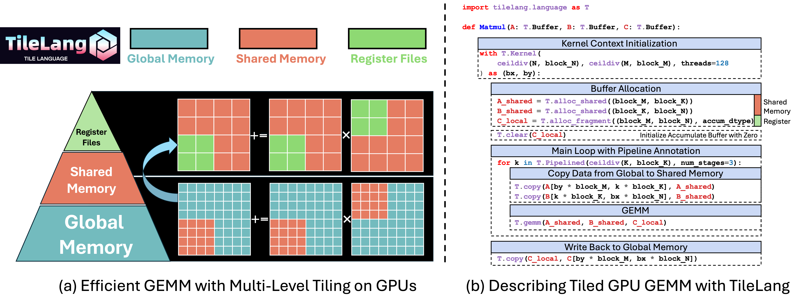

# TileLang 核心关键字与概念

## 文档定位

本文档是 TileLang 关键字的**速查手册**，逐个解释每个原语的语法、语义、与 GPU 硬件的对应关系，以及使用场景。面向具备 GPU 基础知识的开发者（Expert 层级），提供线程级精确控制。

阅读前请先理解 [GPU 基础概念](./gpu-basic-knowledge.md)（Grid、Block、Wave、Shared Memory/LDS、寄存器、Tiling 等）。本文档以海光 DCU 为主要目标硬件，LDS 默认 64 KB/CU，Wave 为 64 线程。

---

## 前言：TileLang 编程模型

### 什么是 TileLang

TileLang 是一个**面向 GPU/CPU 高性能计算的领域特定语言（DSL）**，以 Pythonic 语法提供显式的硬件内存管理、线程级并行控制和软件流水线能力。它构建于 TVM 之上，通过多层 IR 逐步降级到硬件特定的可执行代码。

### 编译流水线

```
TileLang Source Code（Python）
    │
    ▼
[Parsing] → TileLang IR
    │
    ▼
[Lowering] → TIR（Tensor Intermediate Representation）
    │
    ▼
[Optimization Passes]
    ├─ InferBound（推断循环边界）
    ├─ StorageRewrite（优化内存分配）
    ├─ LayoutInference（布局推断）
    ├─ LowerThreadAllreduce（线程级归约）
    ├─ InjectDoubleBuffer（双缓冲插入）
    ├─ VectorizeLoop（循环向量化）
    └─ ...
    │
    ▼
[Code Generation] → CUDA / ROCm(HIP) / Metal
    │
    ▼
Binary Kernel → GPU 执行
```

支持 NVIDIA（CUDA）、AMD（ROCm/HIP）、海光 DCU（HCU）、华为昇腾（AscendC）、Apple Metal 等主流 GPU 后端。

### 显式内存层级控制

TileLang 的核心思想是将 **Tile（分块）** 作为一等公民。一个 Tile 表示数据中的一个形状化片段，由 warp 或 thread block 独立持有和操作。开发者显式指定：

- **数据在哪里**：`T.alloc_shared`（LDS）、`T.alloc_fragment`（寄存器）、`T.alloc_local`（线程私有）
- **数据怎么搬**：`T.copy`（同步）、`T.async_copy`（异步）
- **怎么算**：`T.gemm`（矩阵乘）、逐元素运算、归约

`T.alloc_fragment` 分配的不是单个线程的寄存器，而是**整个 Thread Block 的寄存器文件**中的一块。TileLang 的编译 Pass **Layout Inference** 自动推导每个线程持有 fragment 的哪个子矩阵，生成最优的数据分布。

### 编程模型图示：多层分块 GEMM 全景

下图完整展示了 TileLang 的分层分块 GEMM 编程模型，打通 **GPU 硬件分层存储** 与 **TileLang DSL 语法** 的映射关系：



**左半部分 (a) — 硬件原理**：

- **存储金字塔**（绿色→红色→青蓝）：寄存器文件（最快、最小）→ Shared Memory/LDS（片上高速缓存）→ Global Memory（容量最大、延迟最高）
- **蓝色弧形箭头**：数据流转路径 Global → Shared → Register，体现分层缓存分块
- **两层网格**：下层 Global Memory 存储完整大矩阵（红色小块 = 当前 Block 待处理的 tile）；上层 Shared Memory 存放搬运来的 tile 副本，再拆分为更小块送入寄存器执行计算。核心语义：`C_tile += A_tile × B_tile`

**右半部分 (b) — TileLang 代码映射**（从上到下，每段代码对应一层硬件操作）：

| 代码块 | 对应硬件层级 | 关键原语 |
|--------|------------|---------|
| Kernel 启动配置 | Grid/Block 线程组织 | `T.Kernel(grid_x, grid_y, threads=128)` |
| 内存缓冲区分配 | Shared Memory + 寄存器 | `T.alloc_shared`（红色图例）、`T.alloc_fragment`（绿色图例） |
| 流水线主循环 | 加载与计算重叠 | `T.Pipelined(..., num_stages=3)` |
| Global → Shared 数据搬运 | 图左蓝色弧形箭头 | `T.copy(A[..], A_shared)` |
| GEMM 计算 | 寄存器级乘加 | `T.gemm(A_shared, B_shared, C_local)` |
| 结果写回 Global Memory | 寄存器 → 全局显存 | `T.copy(C_local, C[...])` |

这张图的核心价值：**一行 TileLang 原语对应一层硬件操作**，显式控制从全局显存到寄存器的完整数据流，是理解本文档所有原语设计动机的起点。

### 与本文档的关系

后续章节按照"定义 Kernel → 分配内存 → 搬运数据 → 计算 → 控制流 → 布局优化 → 同步 → 调试 → 编译配置"的顺序逐一展开，最后给出完整的 GEMM 示例和速查表。

---

## 一、基础骨架

**函数装饰器**：`@T.prim_func` 将函数标记为 IR 函数，参数用 `T.Tensor(shape, dtype)` 标注，返回 IR 对象不直接执行；`@tl.jit` 将返回 prim_func 的 Python 工厂函数 JIT 编译为可调用的 GPU kernel，支持 `out_idx` 指定输出参数、`pass_configs` 传递编译选项。

**Kernel 启动配置**：`T.Kernel(grid_x, grid_y, threads=128) as (bx, by)` 定义 GPU 的 Grid/Block 组织方式，`bx`/`by` 对应 `blockIdx.x`/`blockIdx.y`，`threads` 为每个 Block 内的线程数（DCU 上应为 64 的倍数，最大 1024）。也支持一维 Grid：`T.Kernel(grid_size, threads=...) as (block_id)`。

**编译时工具函数**：`T.dynamic("M N K")` 声明符号变量；`T.ceildiv(a, b)` 向上取整除；`T.min(a, b)` 生成 Min 表达式。三者均在编译时求值，"冻结"为常量传入 prim_func。

下面是一个完整的向量加法示例，把三者串起来：

```python
from tilelang import jit
import tilelang.language as T

@jit
def add(N: int, block: int = 256, dtype: str = "float32"):
    @T.prim_func                                         # ❶ 函数装饰器
    def add_kernel(
        A: T.Tensor((N,), dtype),
        B: T.Tensor((N,), dtype),
        C: T.Tensor((N,), dtype),
    ):
        with T.Kernel(T.ceildiv(N, block), threads=block) as bx:  # ❷ Kernel 启动配置
            for i in T.Parallel(block):
                gi = bx * block + i                       # ❸ 编译时工具函数
                if gi < N:                                #   T.ceildiv 计算 grid size
                    C[gi] = A[gi] + B[gi]
    return add_kernel
```

运行输出示例：

```
[TileLang] completes to compile kernel `add_kernel`
N=1048576, max_diff=0.000000, passed.
```

完整代码见 [examples/vector_add.py](examples/vector_add.py)。

---

## 二、内存分配

### `T.alloc_shared` — 分配 Shared Memory 缓冲区

```python
A_shared = T.alloc_shared((block_M, block_K), dtype="float16")
```

在 GPU 的 LDS 上分配二维缓冲区：

- **生命周期**：当前 Block 内有效，Block 执行完毕自动释放
- **可见范围**：Block 内所有线程共享，其他 Block 不可访问
- **性能意义**：LDS 比 Global Memory 快约 10-20 倍，是分块算法的核心加速手段
- **容量约束**：大小直接决定单 Block 占用多少 LDS，结合 `num_stages` 会倍数放大

### `T.alloc_fragment` — 分配寄存器级缓冲区

```python
C_local = T.alloc_fragment((block_M, block_N), dtype="float32")
```

在寄存器文件上分配缓冲区，用于存储计算中间结果：

- `fragment` 不是单个线程的寄存器，而是**整个 Thread Block 的寄存器文件**中的一块
- TileLang 的 Layout Inference 会自动推导每个线程持有 fragment 的哪个子矩阵
- 寄存器是最快的内存（~1 cycle 延迟），累加器应放在 fragment 中
- 使用前必须用 `T.clear` 初始化为零
- fragment 也可用于存储输入数据（如 `A_local`、`B_local`），当需要手动控制数据在 Shared Memory 和寄存器之间的流转时，把输入也放到 fragment 中

### `T.alloc_local` — 分配线程私有标量/小数组

```python
scale = T.alloc_local([1], dtype="float32")
lse_max = T.alloc_local([1], dtype="float32")
```

在线程私有内存（local memory）中分配标量或小数组。常用于存储中间标量值（scale、max、LSE 等），配合归约操作使用。注意：local memory 可能溢出到 Global Memory，频繁访问可能影响性能。

### `T.clear` / `T.fill` — 缓冲区初始化

```python
T.clear(C_local)       # 所有元素置零
T.fill(buf, value)     # 所有元素填充为 value
```

`T.clear` 等价于 `T.fill(buf, 0)`。`T.fill` 支持任意填充值，常用于：
- 累加器初始化为零（`T.clear`）
- 最大/最小值初始化（`T.fill(buf, T.infinity("float32"))` 或 `T.fill(buf, -T.infinity("float32"))`）

---

## 三、数据搬运

### `T.copy` — 同步数据搬运

```python
# Global → Fragment（直接加载到寄存器，绕开 Shared Memory）
T.copy(A[by * block_M, k * block_K], A_local, coalesced_width=8)

# Fragment → Shared（寄存器写入 LDS，常用于 swizzle 转置）
T.copy(A_local, A_shared)

# Shared → Fragment（从 LDS 读取到寄存器）
T.copy(A_shared, A_local_)

# Fragment → Global（寄存器写回全局内存）
T.copy(C_local, C[by * block_M, bx * block_N])

# Fragment → Shared → Global（通过 LDS 中转写回，确保 coalesced）
T.copy(C_local, C_shared)
T.copy(C_shared, C[by * block_M, bx * block_N])
```

`T.copy` 是 TileLang 中**统一的数据搬运原语**，支持任意内存层级之间的传输：

- **语义上是同步的**：`T.copy` 执行完毕后，目标缓冲区数据保证可用
- 编译器自动优化：根据源/目标类型和 GPU 架构，自动选择最优底层指令
- 自动 coalesce：保证 Global Memory 读写是合并访问

#### `coalesced_width` 参数

```python
T.copy(src, dst, coalesced_width=8)
```

指定 Global Memory 访问时的合并宽度（以元素为单位）。例如 `coalesced_width=8` 表示编译器会尝试用 128-bit（8×16bit）向量化加载指令一次性读取 8 个 fp16 元素，提高带宽利用率。这个值需要根据数据类型和目标硬件调整。

### `T.async_copy` — 显式异步搬运（进阶）

```python
T.async_copy(src, dst)      # 发起异步拷贝，不等完成就继续
T.ptx_wait_group(N)         # 等待还剩 N 组未完成的异步拷贝
```

需要手动管理同步，适合需要精细控制异步预取时机的场景。如果 `T.Pipelined` 已经满足需求，不需要用这个。

---

## 四、计算

### `T.gemm` — 矩阵乘法原语

```python
# 基础用法：Shared Memory 输入
T.gemm(A_shared, B_shared, C_local)

# 进阶用法：Fragment 输入 + 参数控制
T.gemm(A_local, B_local, C_local, k_pack=2, transpose_B=True,
       policy=T.GemmWarpPolicy.FullCol)
```

在 Shared Memory 或 Fragment 上的两个输入矩阵做矩阵乘法，结果累加到 fragment 累加器（`C += A @ B`）：

- 输入 A、B 可以位于 **Shared Memory**（`T.alloc_shared`）或 **Fragment**（`T.alloc_fragment`）
- 累加器 C 必须位于 **Fragment**（`T.alloc_fragment`）
- 编译器根据 GPU 架构自动降级为最优硬件指令：DCU 的 M-FMA 指令、NVIDIA Tensor Core 等

#### `k_pack` 参数

```python
T.gemm(A, B, C, k_pack=2)
```

控制 K 维度的打包因子。`k_pack=2` 表示每次迭代处理 K 维度的 2 个元素，利用向量化指令一次完成多个乘加运算。这个值需要与数据类型和目标架构的指令能力匹配。

#### `transpose_B` 参数

```python
T.gemm(A, B, C, transpose_B=True)
```

当 B 矩阵的存储格式为 **N×K（列主序）** 而非 K×N（行主序）时，设置 `transpose_B=True` 告诉编译器 B 已经在逻辑上被转置了。这对应 DCU 上 B 矩阵通常按 N×K 存储的惯例，避免手动转置的开销。

#### `T.GemmWarpPolicy` — GEMM Warp 分区策略

```python
T.gemm(A, B, C, policy=T.GemmWarpPolicy.FullCol)
```

控制 `T.gemm` 内部 Warp 在 M、N 维度上的分区方式，影响计算吞吐和寄存器压力：

| 策略 | 含义 | 适用场景 |
|------|------|---------|
| `Square`（默认） | 在 M 和 N 之间平衡分配 warp | 通用场景，方阵或接近方阵 |
| `FullRow` | 所有 warp 沿 M 方向排列 | M 远大于 N |
| `FullCol` | 所有 warp 沿 N 方向排列 | N 远大于 M（如 attention 中 N 较小） |
| `FullColK` | 所有 warp 沿 N 和 K 方向排列 | 需更细粒度的 K 并行 |

策略选择直接影响每个 warp 处理的 tile 形状和寄存器使用量，应根据矩阵形状和 block tile 大小来调整。

### 逐元素数学运算

以下原语可在 prim_func 内直接使用，对应 GPU 的逐元素运算指令：

| 原语 | 用途 | 典型场景 |
|------|------|---------|
| `T.max(a, b)` | 取两数最大值 | ReLU、attention score 裁剪 |
| `T.exp(x)` / `T.exp2(x)` | 指数 / 2 的指数 | softmax、attention |
| `T.log(x)` / `T.log2(x)` | 自然对数 / 以 2 为底对数 | 交叉熵、log-softmax |
| `T.rsqrt(x)` | 倒数平方根 | LayerNorm、RMSNorm |
| `T.sigmoid(x)` | Sigmoid 激活 | 门控机制 |
| `T.cast(x, dtype)` | 类型转换 | 精度切换（如 fp16 → fp32） |
| `T.infinity(dtype)` | 该类型的无穷大值 | 归约初始化（`T.fill(buf, -T.infinity("float32"))`） |
| `T.clamp(x, lo, hi)` | 限制在 [lo, hi] 范围 | 数值稳定性 |
| `T.dp4a(A, B, C)` | 4 元素点积累加 | INT8 量化计算 |

### 条件选择

```python
result = T.if_then_else(cond, true_val, false_val)
```

三元条件表达式，等价于 `cond ? true_val : false_val`。常用于边界检查（`indices_local >= 0`）和带 mask 的赋值。注意：这不是控制流分支，而是 IR 表达式，确保所有线程执行同一指令。

### 归约操作

| 原语 | 用途 |
|------|------|
| `T.reduce_sum(buf, axis)` | 沿指定轴求和 |
| `T.reduce_max(buf, axis)` | 沿指定轴取最大值 |
| `T.reduce_min(buf, axis)` | 沿指定轴取最小值 |
| `T.reduce_sum_warp(...)` | Warp 内求和归约 |

归约操作的累加器需要用 `T.clear` 或 `T.fill` 初始化，结果通常写入 `T.alloc_local` 分配的缓冲区中。

### 第二~四章总结：基础 GEMM

下面用前三章的全部知识——内存分配（`alloc_shared`/`alloc_fragment`/`clear`）、数据搬运（`T.copy`）、计算（`T.gemm`）——组合出一个完整的基础 GEMM（每个 Block 处理一个 tile）：

```python
@T.prim_func
def gemm(
    A: T.Tensor((M, K), "float16"),
    B: T.Tensor((K, N), "float16"),
    C: T.Tensor((M, N), "float16"),
):
    with T.Kernel(T.ceildiv(N, BN), T.ceildiv(M, BM), threads=128) as (bx, by):
        A_s = T.alloc_shared((BM, BK), "float16")     # 二、内存分配
        B_s = T.alloc_shared((BK, BN), "float16")
        C_f = T.alloc_fragment((BM, BN), "float32")
        T.clear(C_f)

        for ko in T.Pipelined(T.ceildiv(K, BK), num_stages=3):
            T.copy(A[by * BM, ko * BK], A_s)           # 三、数据搬运
            T.copy(B[ko * BK, bx * BN], B_s)
            T.gemm(A_s, B_s, C_f)                      # 四、计算

        T.copy(C_f, C[by * BM, bx * BN])               # 结果写回
```

运行输出示例：

```
Loading tilelang libs from dev root: /workspace/test/tilelang/build
M=1024, N=1024, K=512, max_diff=0.031250, passed.
```

这是 TileLang 最经典的 GEMM 骨架：Global→Shared→gemm→Global。控制流优化（`T.Pipelined`、`T.Persistent`）将在下一章展开。

---

## 五、控制流

### 控制流选择总览

| 原语 | 执行模式 | 何时使用 |
|------|---------|---------|
| `T.serial(n)` | 串行，n 次迭代按顺序执行 | 迭代之间有依赖，或不需要并行/预取 |
| `T.unroll(n)` | 串行 + 编译时展开循环体 | 迭代次数很少且固定（如 4、8），消除循环开销 |
| `T.Parallel(n)` | 并行，n 次迭代分配到所有线程 | 迭代间无依赖，适合 Element-wise 操作 |
| `T.Pipelined(n, num_stages)` | 串行 + 多阶段预取，计算和加载重叠 | 循环体内有"加载数据 → 计算"模式，想隐藏访存延迟 |
| `T.Persistent(dims, grid, id, group_size)` | 持久化调度，少量 Block 循环处理大量 tile | Block 数少于 tile 数时，Block 自动轮询处理多个 tile |

### 选择流程图

```
迭代之间有数据依赖吗？
  ├── 有依赖 → 必须串行
  │     ├── 循环体内是先加载数据再做计算吗？
  │     │     ├── 是，且迭代次数多 → T.Pipelined
  │     │     └── 否，纯计算或迭代少 → T.serial
  │     └── 迭代次数很少且固定吗？
  │           └── 是 → T.unroll（替代 T.serial）
  └── 无依赖 → 可以并行
        └── T.Parallel

Block 数量 < 实际 tile 数量，想让 Block 循环处理多个 tile？
  └── T.Persistent
```

### `T.serial` — 串行循环

```python
for i in T.serial(N):
    result[i] = result[i - 1] + data[i]  # 迭代间有依赖，必须串行
```

对应普通 for 循环，每次迭代顺序执行。

### `T.unroll` — 编译时展开

```python
for i in T.unroll(4):
    x[i] = x[i] + 1
# 编译后等价于：
# x[0] = x[0] + 1
# x[1] = x[1] + 1
# x[2] = x[2] + 1
# x[3] = x[3] + 1
```

编译器在编译时把循环体复制 n 份，消除循环计数器和分支跳转开销。只适合循环次数很小且固定时使用。

### `T.Parallel` — 并行循环

```python
for i in T.Parallel(N):
    C[i] = A[i] + B[i]  # 每个元素计算独立，可以并行
```

将 N 次迭代并行分配给 Block 内所有线程。Layout Inference 自动决定每个线程执行哪些迭代。注意 `T.gemm` 内部已隐含并行分配，不需要用 `T.Parallel` 包裹。

### `T.Pipelined` — 软件流水线

```python
for k in T.Pipelined(T.ceildiv(K, block_K), num_stages=3):
    T.copy(A[...], A_shared)
    T.copy(B[...], B_shared)
    T.gemm(A_shared, B_shared, C_local)
```

串行执行，但通过多阶段预取让**计算和数据加载重叠**：

```
T.serial（无流水线）:
  [加载1][计算1]          [加载2][计算2]          [加载3][计算3]
  ← GPU 等数据 →

T.Pipelined(num_stages=3):
  [加载1][加载2][加载3]
  [等待 ][计算1][计算2][计算3]  ← 加载和计算重叠
         [加载4][加载5][加载6]
```

- **代价**：LDS 占用 = `num_stages × (A_shared + B_shared)`
- **调优**：在 LDS 容量允许的前提下，增加 `num_stages` 可以更好地隐藏访存延迟

### `T.Persistent` — 持久化 Block 调度

```python
for bx, by in T.Persistent(
    [T.ceildiv(N, block_N), T.ceildiv(M, block_M)],  # tile 网格尺寸
    wgs_per_cu * cu_num,                               # 实际 Block 数量
    block_id,                                          # 当前 Block 的一维 ID
    group_size=1                                       # tile 分组大小
):
    ...
```

`T.Persistent` 是持久化 Kernel 的核心原语，解决的问题是：

> **当 Grid 中的 Block 数量少于实际 tile 数量时，让每个 Block 自动轮询处理多个 tile。**

持久化 Kernel 只启动少量 Block（等于 CU 数量 × wgs_per_cu），每个 Block 通过 `T.Persistent` 自动获取下一个要处理的 tile 坐标 `(bx, by)`，处理完后继续获取下一个，直到所有 tile 处理完毕。相比普通 GEMM（有多少 tile 就启动多少 Block），减少了 GPU 硬件调度器的 Block 创建/分配/回收开销。

**参数说明**：

- 第一个参数 `[tile_x, tile_y]`：二维 tile 网格的尺寸（总共 tile_x × tile_y 个 tile）
- 第二个参数：实际启动的 Block 总数（通常 = `wgs_per_cu × cu_num`，即每个 CU 上驻留 wgs_per_cu 个 Block）
- 第三个参数 `block_id`：当前 Block 在一维 Grid 中的 ID（来自 `T.Kernel(grid_size, ...) as (block_id)`）
- `group_size`：tile 分组大小，控制相邻 tile 是否合并处理。`group_size=1` 表示每个 Block 每次只拿一个 tile

---

## 六、布局注解（Layout Annotation）

### `T.annotate_layout` — 声明缓冲区的内存布局

```python
C_shared = T.alloc_shared((block_M, sub_block_N), dtype)
T.annotate_layout({
    C_shared: tl.layout.make_hcu_swizzled_layout(C_shared, major_pack=2),
    B_shared: tl.layout.make_hcu_swizzled_layout(B_shared, major_pack=2),
    A_shared: tl.layout.make_hcu_swizzled_layout(A_shared, major_pack=2),
})
```

`T.annotate_layout` 告诉编译器某个 Shared Memory 缓冲区的**数据排布方式**（layout），编译器根据这个信息生成高效的向量化读写指令。

#### 为什么需要 Swizzle 布局

正常情况下，Shared Memory 中的数据按行优先顺序排列。当多个线程同时访问同一 bank 的不同地址时，会发生 **bank conflict**，导致访问串行化、带宽下降。

**Swizzle 布局**通过对地址做 XOR 变换，将原本可能冲突的访问分散到不同的 bank，减少 bank conflict。具体来说：

- `make_hcu_swizzled_layout(buf, major_pack=2)`：为 DCU（HCU）生成 swizzle 布局
- `major_pack=2`：在 N 维度（major dimension）上每 2 个元素打包，控制 swizzle 的粒度

**什么时候需要 annotate_layout**：

- 当 `T.gemm` 的输入是 Fragment（而不是 Shared Memory）时，你需要手动控制数据在 Shared Memory 中的布局，因为数据路径变为 Global → Fragment → Shared → Fragment → gemm，编译器无法自动推断 Shared Memory 的布局
- 当用 `T.copy` 做 Fragment ↔ Shared 传输时，正确的 swizzle 布局可以让 `ds_write`/`ds_read` 指令以向量化方式执行

### `tl.layout.make_hcu_swizzled_layout` — DCU Swizzle 布局

```python
tl.layout.make_hcu_swizzled_layout(buffer, major_pack=2)
```

为 DCU 的 Shared Memory 缓冲区生成 swizzle 地址变换，返回一个 Layout 对象传给 `T.annotate_layout`。`major_pack` 控制向量化宽度。

---

## 七、同步与线程索引

### 同步原语

```python
T.sync_threads()   # Block 内所有线程同步（__syncthreads）
T.sync_warp()      # Wave 内线程同步（__syncwarp，DCU 上 64 线程）
```

Shared Memory 写入后、读取前通常需要同步。但 TileLang 的 `T.copy` 和 `T.gemm` 在大多数场景下已自动插入必要的同步。**当手动做 Fragment ↔ Shared 的数据流转时**，需要显式插入同步：

```python
T.copy(C_local_0, C_shared_0)
T.sync_threads()                                 # 确保所有线程写入完成
T.copy(C_shared_0, C[by * block_M, bx * block_N])
T.sync_threads()                                 # 确保 C_shared_0 可以被下一轮复用
T.copy(C_local_1, C_shared_0)
```

### 线程索引

```python
tx = T.get_thread_binding()         # 当前线程的 threadIdx.x
tx, ty = T.get_thread_bindings()    # threadIdx.x, threadIdx.y
```

获取当前线程在 Block 内的索引，用于手动控制线程级数据分配（如 sparse attention 中的 gather/scatter 操作）。大多数情况下 Layout Inference 会自动分配，不需要手动获取。

---

## 八、调试

### `T.print` — 打印缓冲区内容

```python
T.print(C_f, msg='accumulator:')
T.print(A_s, msg='A tile:')
```

从单个线程打印缓冲区或标量的内容，避免多线程输出洪水。用于快速验证中间结果。

### `T.device_assert` — 设备端断言

```python
T.device_assert(cond, msg='index out of range')
```

在 GPU 上执行条件检查，条件为假时触发断言。用于调试边界条件或数值异常。

---

## 九、编译 Pass 配置

### `tl.PassConfigKey` — 编译 Pass 开关

```python
@tl.jit(out_idx=[-1], pass_configs={
    tl.PassConfigKey.TL_ENABLE_AGGRESSIVE_SHARED_MEMORY_MERGE: True,
    tl.PassConfigKey.TL_DISABLE_THREAD_STORAGE_SYNC: True,
})
```

编译 Pass 配置键，控制 TileLang 编译器的优化行为。常用的包括：

| 配置键 | 作用 |
|-------|------|
| `TL_ENABLE_AGGRESSIVE_SHARED_MEMORY_MERGE` | 激进合并 Shared Memory 分配，减少 LDS 碎片，让多个小缓冲区共享同一块 LDS 空间 |
| `TL_DISABLE_THREAD_STORAGE_SYNC` | 禁用线程存储同步，在确定不需要 `__syncthreads` 的场景下消除多余的同步屏障 |

---

## 十、持久化 GEMM 完整示例

下面是将前九章全部知识融会贯通的完整示例：持久化调度 + Swizzle 布局优化 + Fragment 中转数据流。

```python
@tl.jit(out_idx=[-1], pass_configs={
    tl.PassConfigKey.TL_ENABLE_AGGRESSIVE_SHARED_MEMORY_MERGE: True,
})
def gemm_persistent(M, N, K, block_M, block_N, block_K,
                    num_stages, thread_num, wgs_per_cu=2,
                    dtype="float16", accum_dtype="float"):
    cu_num = torch.cuda.get_device_properties("cuda").multi_processor_count
    m_blocks = T.ceildiv(M, block_M)
    n_blocks = T.ceildiv(N, block_N)
    grid_size = T.min(m_blocks * n_blocks, wgs_per_cu * cu_num)

    split_n = 2
    sub_block_N = block_N // split_n

    @T.prim_func
    def _gemm_persistent(
        A: T.Tensor((M, K), dtype),
        B: T.Tensor((N, K), dtype),   # 注意：B 是 N×K 存储（转置）
        C: T.Tensor((M, N), dtype),
    ):
        with T.Kernel(grid_size, threads=thread_num) as (block_id):
            # Shared Memory 分配
            A_shared = T.alloc_shared((block_M, block_K), dtype)
            B_shared_0 = T.alloc_shared((sub_block_N, block_K), dtype)

            # Fragment 分配：输入缓存（用于手动数据流转）
            A_local_0 = T.alloc_fragment((block_M, block_K), dtype)
            A_local_0_ = T.alloc_fragment((block_M, block_K), dtype)
            B_local_0 = T.alloc_fragment((sub_block_N, block_K), dtype)
            B_local_1 = T.alloc_fragment((sub_block_N, block_K), dtype)
            B_local_0_ = T.alloc_fragment((sub_block_N, block_K), dtype)
            B_local_1_ = T.alloc_fragment((sub_block_N, block_K), dtype)

            # Fragment 分配：输出累加器（split_n 份，各算一半 N）
            C_local_0 = T.alloc_fragment((block_M, sub_block_N), dtype="float32")
            C_local_1 = T.alloc_fragment((block_M, sub_block_N), dtype="float32")

            # Shared Memory 分配：输出中转缓冲区
            C_shared_0 = T.alloc_shared((block_M, sub_block_N), dtype)
            T.annotate_layout({
                C_shared_0: tl.layout.make_hcu_swizzled_layout(C_shared_0, major_pack=2),
                B_shared_0: tl.layout.make_hcu_swizzled_layout(B_shared_0, major_pack=2),
                A_shared: tl.layout.make_hcu_swizzled_layout(A_shared, major_pack=2),
            })

            # 持久化调度：少量 Block 轮询处理所有 tile
            for bx, by in T.Persistent(
                [n_blocks, m_blocks],
                grid_size,
                block_id,
                group_size=1
            ):
                if by * block_M < M and bx * block_N < N:
                    T.clear(C_local_0)
                    T.clear(C_local_1)

                    for k in T.Pipelined(T.ceildiv(K, block_K), num_stages=num_stages):
                        # 数据路径：Global → Fragment → Shared(swizzle) → Fragment → gemm
                        # 目的：通过 swizzle 布局减少 bank conflict
                        T.copy(A[by * block_M, k * block_K], A_local_0, coalesced_width=8)
                        T.copy(A_local_0, A_shared)

                        T.copy(B[bx * block_N, k * block_K], B_local_0, coalesced_width=8)
                        T.copy(B[bx * block_N + sub_block_N, k * block_K], B_local_1, coalesced_width=8)

                        T.copy(B_local_0, B_shared_0)
                        T.copy(B_shared_0, B_local_0_)
                        T.copy(B_local_1, B_shared_0)
                        T.copy(B_shared_0, B_local_1_)

                        T.copy(A_shared, A_local_0_)

                        T.gemm(A_local_0_, B_local_0_, C_local_0, k_pack=2, transpose_B=True)
                        T.gemm(A_local_0_, B_local_1_, C_local_1, k_pack=2, transpose_B=True)

                    # 写回：Fragment → Shared → Global（通过 Shared 中转确保 coalesced）
                    T.copy(C_local_0, C_shared_0)
                    T.copy(C_shared_0, C[by * block_M, bx * block_N])
                    T.copy(C_local_1, C_shared_0)
                    T.copy(C_shared_0, C[by * block_M, bx * block_N + sub_block_N])

    return _gemm_persistent
```

### 关键设计要点

1. **持久化调度**：`grid_size = wgs_per_cu × cu_num`，只启动少量 Block，每个 Block 通过 `T.Persistent` 循环处理多个 tile。好处是减少 Block 调度开销，让 CU 始终有活干。

2. **N 维度拆分（split_n）**：将 `block_N` 拆成两半（`sub_block_N`），每次只分配一半 N 的 Shared Memory，减少 LDS 占用。

3. **Fragment 中转 + Swizzle**：数据路径是 `Global → Fragment → Shared(swizzle) → Fragment → gemm`。Shared Memory 是 swizzle 布局的，`T.gemm` 的输入是 Fragment。编译器根据 `T.annotate_layout` 知道 Shared Memory 的 swizzle 排布，从而生成高效的 `ds_read`/`ds_write` 指令。

4. **B 转置存储**：B 矩阵存储为 N×K（而非 K×N），通过 `transpose_B=True` 告诉编译器无需手动转置。

5. **结果写回通过 Shared 中转**：`Fragment → Shared → Global`，确保 Global Memory 写入是 coalesced 的。

---

## 附录：常用原语速查

### 函数定义
| 原语 | 用途 |
|------|------|
| `@T.prim_func` | 定义 TileLang IR 函数 |
| `@tl.jit(out_idx, pass_configs)` | JIT 编译包装器 |
| `T.dynamic(name)` | 定义编译时符号变量 |
| `T.ceildiv(a, b)` | 编译时向上取整除 |

### 内存与搬运
| 原语 | 用途 |
|------|------|
| `T.alloc_shared(shape, dtype)` | 分配 Shared Memory 缓冲区 |
| `T.alloc_fragment(shape, dtype)` | 分配寄存器级缓冲区 |
| `T.alloc_local(shape, dtype)` | 分配线程私有标量/小数组 |
| `T.copy(src, dst, coalesced_width=...)` | 同步数据搬运，支持任意内存层级 |
| `T.async_copy(src, dst)` | 显式异步搬运（需手动等待） |
| `T.clear(buf)` / `T.fill(buf, val)` | 缓冲区清零/填充 |
| `T.annotate_layout({buf: layout})` | 声明缓冲区内存布局 |
| `tl.layout.make_hcu_swizzled_layout(buf, major_pack=N)` | DCU Swizzle 布局生成 |

### 计算
| 原语 | 用途 |
|------|------|
| `T.gemm(A, B, C, k_pack=N, transpose_B=True, policy=...)` | 矩阵乘法 |
| `T.GemmWarpPolicy.Square/FullRow/FullCol/FullColK` | GEMM Warp 分区策略 |
| `T.reduce_sum/max/min(buf)` | 归约操作 |
| `T.reduce_sum_warp(...)` | Warp 内求和归约 |
| `T.max(a, b)` / `T.exp/log/exp2/log2(x)` | 逐元素数学运算 |
| `T.rsqrt(x)` / `T.sigmoid(x)` | 逐元素数学运算 |
| `T.cast(x, dtype)` | 类型转换 |
| `T.infinity(dtype)` | 该类型的无穷大值 |
| `T.clamp(x, lo, hi)` | 限制在 [lo, hi] 范围 |
| `T.dp4a(A, B, C)` | 4 元素点积累加 |
| `T.if_then_else(cond, t, f)` | 条件选择表达式 |

### 控制流
| 原语 | 执行模式 | 使用场景 |
|------|---------|---------|
| `T.serial(n)` | 串行 | 迭代间有依赖 |
| `T.unroll(n)` | 串行+编译展开 | 迭代次数少且固定 |
| `T.Parallel(n)` | 线程并行 | 迭代间无依赖，Element-wise |
| `T.Pipelined(n, num_stages)` | 串行+预取重叠 | 加载与计算重叠，隐藏访存延迟 |
| `T.Persistent(dims, grid, id, group_size)` | 持久化 Block 调度 | Block 数 < tile 数，Block 轮询处理 tile |

### 同步与线程索引
| 原语 | 用途 |
|------|------|
| `T.sync_threads()` | Block 内全同步 |
| `T.sync_warp()` | Wave 内同步（DCU: 64 线程） |
| `T.get_thread_binding(dim)` | 获取当前线程索引（threadIdx） |

### 调试
| 原语 | 用途 |
|------|------|
| `T.print(buf, msg='...')` | 打印缓冲区/标量（单线程） |
| `T.device_assert(cond, msg='...')` | 设备端断言 |

### 编译配置
| 配置键 | 作用 |
|-------|------|
| `TL_ENABLE_AGGRESSIVE_SHARED_MEMORY_MERGE` | 激进合并 Shared Memory 分配 |
| `TL_DISABLE_THREAD_STORAGE_SYNC` | 禁用线程存储同步 |
